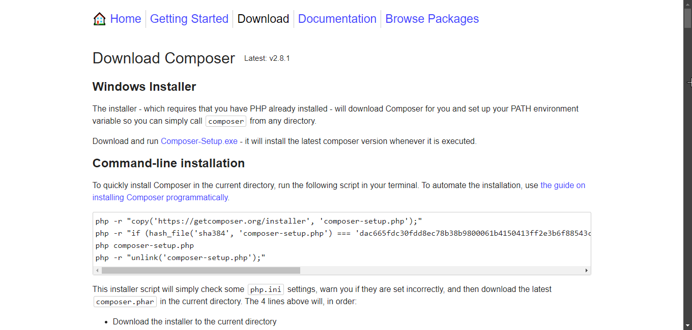
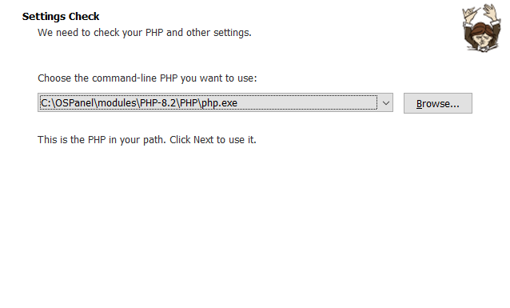
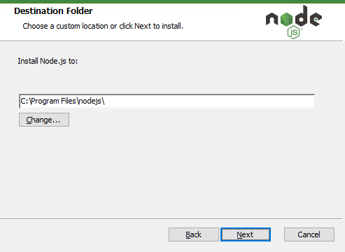

# Fullstack: Сайт на Next.js (Frontend) + Laravel (Backend)

## Установка

### Склонировать данный репозиторий
```
git clone https://github.com/SkalZOne/testing_order
```

### Установить зависимости

<details>
<summary>Если composer или node.js отсутствуют</summary>

<details> 
<summary>Composer</summary>

> -   Перейти по данной [ссылке](https://getcomposer.org/download/) >
>
> -   Кликнуть по ссылке **Composer-Setup.exe** и открыть исполняемый файл
> -   Выбрать один из методов установки
>     
> -   Нажать далее
> -   Выбрать путь до установленного PHP
>     
> -   Нажать 2 раза далее
> -   Нажать установить
> -   Готово! :white_check_mark:

</details>

<details> 
<summary>Node.js</summary>

> -   Перейти по данной [ссылке](https://nodejs.org/en) >
>
> -   Кликнуть по кнопке **Download Node.js (LTS)** и открыть исполняемый файл
> -   Нажать далее
> -   Принять пользовательское соглашение
> -   Выбрать путь установки
>     
> -   Нажать 2 раза далее
> -   Нажать установить
> -   Готово! :white_check_mark:

</details>
</details>


#### Frontend

<details>
<summary>Frontend</summary>

1) Перейти в директорию frontend
    ```
    cd frontend
    ```

2) Запустить установка зависимостей
    ```
    npm install
    ```
</details>


#### Backend

<details>
<summary>Backend</summary>

### Перейти в директорию backend
-   ```
    cd backend
    ```

### Запустить установка зависимостей
-   ```
    composer install
    ```

### Создать .env файл и настроить его

-   ```
    cp .env.example .env
    ```

#### :warning: В случае, если у вас не стоит сервер с базой данных, ничего не меняйте в данном файле, а просто пропустите дальнейшие действия в данном пункте, кроме миграции

-   Открыть созданный файл и перейти на 22 строку

    

-   Отредактировать значения в зависимости от вашей базы данных, в моем случае это выглядит так:

    

- Теперь требуется запустить миграцию и наполнит базу данных фейковыми данными

    ```
    php artisan migrate --seed
    ```

- Создать encryption key в Laravel

    ```
    php artisan key:generate
    ```

Отлично, теперь вы можете переходить к разделу "Запуск"
</details>

## Запуск

### Для запуска сайта требуется открыть 2 терминала

#### В первом требуется перейти в frontend и прописать:

```
npm run dev
```

Данная команда запустит next.js на адресе **localhost:3000**

#### Во втором требуется перейти в backend и прописать:

```
php artisan serve
```

Данная команда запустит laravel на адресе **localhost:8000**

Готово, теперь при переходе на **localhost:3000** откроется основной веб-интерфейс приложения.

</details>

## Примечания

- Были отключены проверки CSRF токена, в целях девелопмента