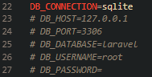
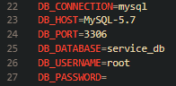
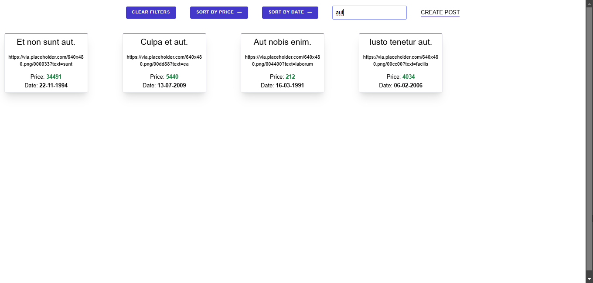
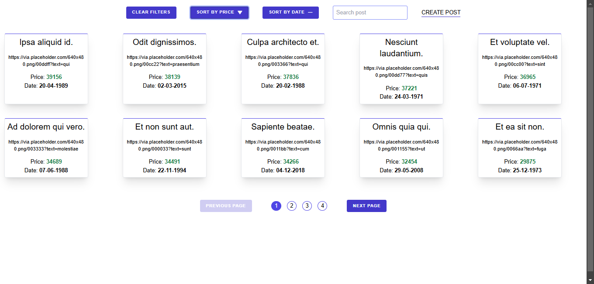
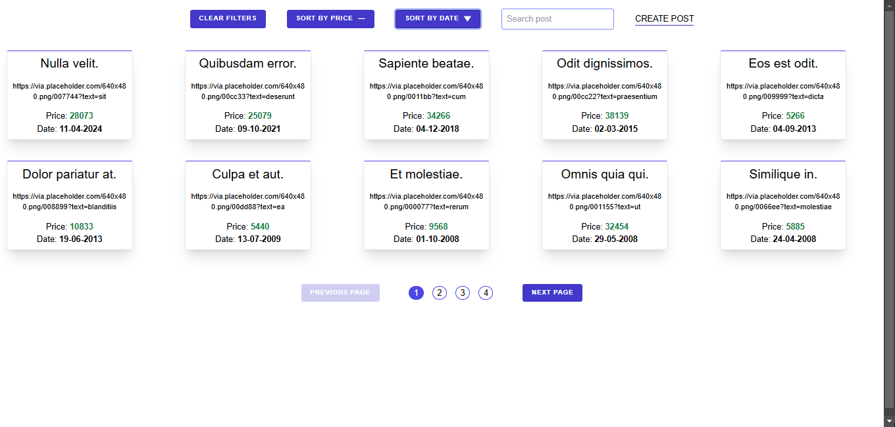
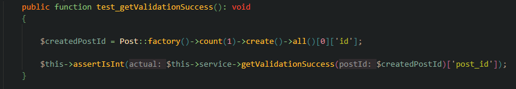
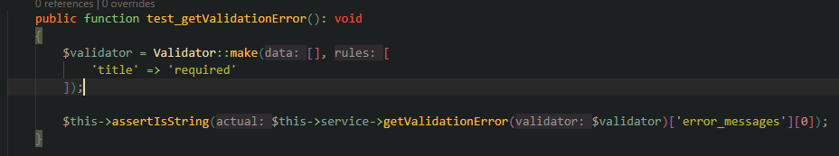
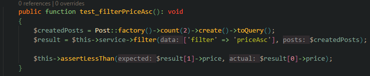

<!-- Repository name -->
<h1>Fullstack: Website on Next.js (Frontend) + Laravel (Backend)</h1>

<!-- Translates -->

<!-- Table of contents -->
<h2>Table of contents</h2>
<ul>

<!-- Installation -->
<li>
    <a href="#installation">Installation</a>
    <ul>
        <li>
            <a href="#installation-clone">Clone repository</a>
        </li>
        <li>
            <a href="#installation-dependencies-base">Install Composer and Node.js</a>
        </li>
        <!-- Sublist -->
        <ul>
            <li>
                <a href="#installation-dependencies-base-composer">Composer</a>
            </li>
            <li>
                <a href="#installation-dependencies-base-node">Node.js</a>
            </li>
        </ul>
        <li>
            <a href="#installation-frontend">Install Frontend part</a>
        </li>
        <li>
            <a href="#installation-backend">Install Backend part</a>
        </li>
    </ul>
</li>

<!-- Launch -->
<li>
    <a href="#launch">Launch</a>
</li>

<!-- What has been implemented -->
<li>
    <a href="#what-implemented">What has been implemented</a>
</li>

<!-- Demonstration -->
<li>
    <a href="#demo">Demonstration</a>
    <!-- Sublist -->
    <ul>
        <li><a href="#main-page">Main page</a></li>
        <li><a href="#main-page-search">Search by title</a></li>
        <li><a href="#main-page-sort-price">Sort by price</a></li>
        <ul>
            <li><a href="#main-page-sort-price-asc">Ascending</a></li>
            <li><a href="#main-page-sort-price-desc">Descending</a></li>
        </ul>
        <li><a href="#main-page-sort-date">Sort by date</a></li>
        <ul>
            <li><a href="#main-page-sort-date-asc">Ascending</a></li>
            <li><a href="#main-page-sort-date-desc">Descending</a></li>
        </ul>
        <li><a href="#main-page-post-create">Creating an post</a></li>
    </ul>
</li>

<!-- Testings -->
<li>
    <a href="#testing">Testings</a>
    <!-- Sublist -->
    <ul>
        <li><a href="#testing-validation">Posts validation</a></li>
        <ul>
            <li><a href="#testing-post-validation-success">Success validation</a></li>
            <li><a href="#testing-post-validation-error">Error validation</a></li>
        </ul>
        <li><a href="#testing-sort">Sortings</a></li>
        <ul>
            <!-- Sorting by date -->
            <li>
                <a href="#testing-sort-date">Sorting by date</a>
                <ul>
                    <li><a href="#testing-sort-date-asc">Ascending</a></li>
                    <li><a href="#testing-sort-date-desc">Descending</a></li>
                </ul>
            </li>
            <!-- Sorting by price -->
            <li>
                <a href="#testing-sort-price">Sorting by price</a>
                <ul>
                    <li><a href="#testing-sort-price-asc">Ascending</a></li>
                    <li><a href="#testing-sort-price-desc">Descending</a></li>
                </ul>
            </li>
        </ul>
    </ul>
</li>

<!-- Remarks -->
<li>
    <a href="#remark">Remarks</a>
</li>
</ul>

<!-- Installation -->
<h2><a id="installation">Installation</a></h2>
<ul>
<!-- Clone repository -->
<li>
    <a id="installation-clone">Clone this repository</a>
    <pre>git clone https://github.com/SkalZOne/testing_order</pre>
</li>

<!-- If composer or node.js is missing -->
<li> 
    <a id="installation-dependencies-base">Installation Сomposer and Node.js</a>
    <ul>
        <!-- Composer -->
        <a id="installation-dependencies-base-composer">Composer</a>
        <ul>
            <li>
                Follow this <a href="https://getcomposer.org/download/">link</a>
            </li>
            <li>
                Follow this link <a href="https://getcomposer.org/download/"><b>Composer-Setup.exe</b></a> and open executable file
            </li>
            <li>
                Select one of the installation methods 
                
            </li>
            <li>Click next</li>
            <li>
                Select the path to installed PHP 
                
            </li>
            <li>Click next 2 times</li>
            <li>Click install</li>
            <li>Ready! ✅</li>
        </ul>
        <!-- Node.JS -->
        <a id="installation-dependencies-base-node">Node.js</a>
        <ul>
            <li>
                Follow this <a href="https://nodejs.org/en">link</a> 
                
            </li>
            <li>Click on the button <b>Download Node.js (LTS)</b> and open executable file</li>
            <li>Click next</li>
            <li>Accept user agreement</li>
            <li>
                Select installation path 
                
            </li>
            <li>Click next 2 times</li>
            <li>Click install</li>
            <li>Ready! ✅</li>
        </ul>
    </ul>
</li>

<!-- Installation Frontend part -->
<li>
    <a id="installation-frontend">Installation Frontend part</a>
    <ul>
        <li>Go to frontend directory</li>
        <pre>cd frontend</pre>
        <li>Run dependency installation</li>
        <pre>npm install</pre>
    </ul>
</li>

<!-- Installation Backend part -->
<li>
    <a id="installation-backend">Installation Backend part</a>
    <ul>
        <li>
            Go to backend directory
            <pre>cd backend</pre>
        </li>
        <li>
            Run dependency installation
            <pre>composer install</pre>
        </li>
        <li>
            Create a .env file and configure it
            <pre>cp .env.example .env</pre>
        </li>
        <li>
            <b>⚠️ If you do not have a server with a database, do not change anything in this file, just skip further steps in this paragraph</b>
            <ul>
                <li>
                    Open the created file and go to line 22 
                    
                </li>
                <li>
                    Edit the values ​​depending on your database, in my case it looks like this: 
                    
                </li>
            </ul>
        </li>
        <li>
            Now you need to run the migration and fill the database with fake data
            <pre>php artisan migrate --seed</pre>
        </li>
        <li>
            Generate encryption key in Laravel
            <pre>php artisan key:generate</pre>
        </li>
    </ul>
</li>

✅Great, you can now move on to the "Startup" section.✅

</ul>

<!-- Startup -->
<h2><a id="launch">Startup</a></h2>
<h3>To launch the site you need to open 2 terminals</h3>
<ul>
    <!-- First -->
    <li>
        The first requires:
        <ul>
            <li>
                Go to frontend directory
                <pre>cd frontend</pre>
            </li>
            <li>
                Start development server
                <pre>npm run dev</pre>
            </li>
        </ul>
        After these steps, the local next.js server will be launched for development at the address <b>localhost:3000</b>
    </li>
    <!-- Second -->
    <li>
        The second requires:
        <ul>
            <li>
                Go to backend directory
                <pre>cd backend</pre>
            </li>
            <li>
                Start development server
                <pre>php artisan serve</pre>
            </li>
        </ul>
        This command will launch laravel at the address <b>localhost:8000</b>
    </li>
</ul>

<h4>✅ Done, now when you go to <b>localhost:3000</b> the main web interface of the application will open. ✅</h4>

<!-- What has been implemented -->
<h2><a id="what-implemented">What has been implemented</a></h2>
<ul>
    <li>Pagination (10 articles on one page)</li>
    <li>Search by article title</li>
    <li>
        Sorting
        <ul>
            <li>
                By price
                <ul>
                    <li>Ascending</li>
                    <li>Descending</li>
                </ul>
            </li>
            <li>
                By date
                <ul>
                    <li>Ascending</li>
                    <li>Descending</li>
                </ul>
            </li>
        </ul>
    </li>
    <li>Creation of articles</li>
    <li>Unit sorting tests</li>
    <li>Unit article validation tests</li>
    <li>Factories for automatically creating articles using the Faker library</li>
</ul>

<!-- Demonstration -->
<h2><a id="demo">Demonstration</a></h2>

<h3><a id="main-page">Main page</a></h3>

---

<h3><a id="main-page-search">Search by title</a></h3>

---

<h3><a id="main-page-sort-price">Sort by price</a></h3>
<h4><a id="main-page-sort-price-asc">Ascending</a></h4>

<h4><a id="main-page-sort-price-desc">Descending</a></h4>

---

<h3><a id="main-page-sort-date">Sort by date</a></h3>
<h4><a id="main-page-sort-date-asc">Ascending</a></h4>

<h4><a id="main-page-sort-date-desc">Descending</a></h4>

---

<h3><a id="main-page-post-create">Creating an article</a></h3>

<!-- Testing -->
<h2><a id="testing">Testing</a></h2>
<a id="testing-validation">Articles validation</a>
<ul>
    <!-- Success validation -->
    <li>
        <h4><a id="testing-post-validation-success">Success validation</a></h4>
        
    </li>
    <!-- Failed validation -->
    <li>
        <h4><a id="testing-post-validation-error">Failed validation</a></h4>
        
    </li>
</ul>

<a id="testing-sort">Sorting</a>
<ul>
    <!-- Sorting by date -->
    <li>
        <a id="testing-sort-date">Sorting by date</a>
        <ul>
            <!-- Ascending -->
            <li><a id="testing-sort-date-asc">Ascending</a></li>
            
            <!-- Descending -->
            <li><a id="testing-sort-date-desc">Descending</a></li>
            
        </ul>
    </li>
    <!-- Sort by price -->
    <li>
        <a id="testing-sort-price">Sort by price</a>
        <ul>
            <!-- Ascending -->
            <li><a id="testing-sort-price-asc">Ascending</a></li>
            
            <!-- Descending -->
            <li><a id="testing-sort-price-desc">Descending</a></li>
            
        </ul>
    </li>
</ul>

<!-- Remarks -->
<h2><a id="remark">Remarks</a></h2>
<ul>
    <li>CSRF token checks have been disabled for development purposes</li>
</ul>
