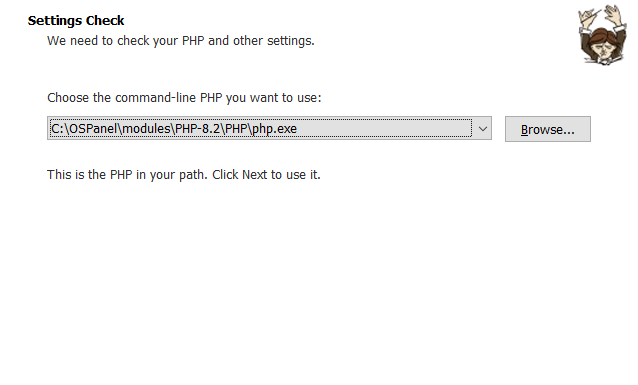
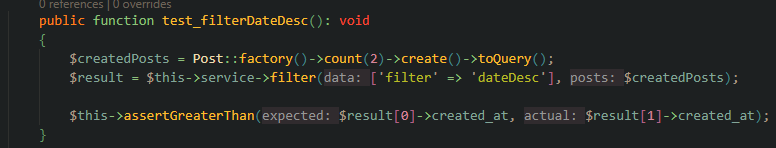

<!-- название репозитория -->
<h1>Fullstack: Сайт на Next.js (Frontend) + Laravel (Backend)</h1>

<!-- Переводы -->

<!-- Оглавление -->
<h2>Оглавление</h2>
<ul>
<!-- Установка -->
<li>
    <a href="#installation">Установка</a>
    <ul>
        <li>
            <a href="#installation-clone">Склонировать репозиторий</a>
        </li>
        <li>
            <a href="#installation-dependencies-base">Установить Composer и Node.js</a>
        </li>
        <!-- Подсписок -->
        <ul>
            <li>
                <a href="#installation-dependencies-base-composer">Composer</a>
            </li>
            <li>
                <a href="#installation-dependencies-base-node">Node.js</a>
            </li>
        </ul>
        <li>
            <a href="#installation-frontend">Установить Frontend часть</a>
        </li>
        <li>
            <a href="#installation-backend">Установить Backend часть</a>
        </li>
    </ul>
</li>

<!-- Запуск -->
<li>
    <a href="#launch">Запуск</a>
</li>

<!-- Что было реализовано -->
<li>
    <a href="#what-implemented">Что было реализовано</a>
</li>

<!-- Демонстрация работы -->
<li>
    <a href="#demo">Демонстрация работы</a>
    <!-- Подсписок -->
    <ul>
        <li><a href="#main-page">Главная страница</a></li>
        <li><a href="#main-page-search">Поиск по заголовку</a></li>
        <li><a href="#main-page-sort-price">Сортировка по цене</a></li>
        <ul>
            <li><a href="#main-page-sort-price-asc">По возрастанию</a></li>
            <li><a href="#main-page-sort-price-desc">По убыванию</a></li>
        </ul>
        <li><a href="#main-page-sort-date">Сортировка по дате</a></li>
        <ul>
            <li><a href="#main-page-sort-date-asc">По возрастанию</a></li>
            <li><a href="#main-page-sort-date-desc">По убыванию</a></li>
        </ul>
        <li><a href="#main-page-post-create">Создание статьи</a></li>
    </ul>
</li>

<!-- Тестирование -->
<li>
    <a href="#testing">Тестирование</a>
    <!-- Подсписок -->
    <ul>
        <li><a href="#testing-validation">Валидация статьей</a></li>
        <ul>
            <li><a href="#testing-post-validation-success">Успешная валидация</a></li>
            <li><a href="#testing-post-validation-error">Неуспешная валидация</a></li>
        </ul>
        <li><a href="#testing-sort">Сортировка</a></li>
        <ul>
            <!-- Сортировка по дате -->
            <li>
                <a href="#testing-sort-date">Сортировка по дате</a>
                <ul>
                    <li><a href="#testing-sort-date-asc">По возрастанию</a></li>
                    <li><a href="#testing-sort-date-desc">По убыванию</a></li>
                </ul>
            </li>
            <!-- Сортировка по цене -->
            <li>
                <a href="#testing-sort-price">Сортировка по цене</a>
                <ul>
                    <li><a href="#testing-sort-price-asc">По возрастанию</a></li>
                    <li><a href="#testing-sort-price-desc">По убыванию</a></li>
                </ul>
            </li>
        </ul>
    </ul>
</li>

<!-- Примечания -->
<li>
    <a href="#remark">Примечания</a>
</li>
</ul>

<!-- Установка -->
<h2><a id="installation">Установка</a></h2>
<ul>
<!-- Склонировать репозиторий -->
<li>
    <a id="installation-clone">Склонировать репозиторий</a>
    <pre>git clone https://github.com/SkalZOne/testing_order</pre>
</li>

<!-- Если composer или node.js отсутствуют -->
<li> 
    <a id="installation-dependencies-base">Установка Сomposer и Node.js</a>
    <ul>
        <!-- Composer -->
        <a id="installation-dependencies-base-composer">Composer</a>
        <ul>
            <li>
                Перейти по этой <a href="https://getcomposer.org/download/">ссылке</a>
            </li>
            <li>
                Перейти по этой ссылке <a href="https://getcomposer.org/download/"><b>Composer-Setup.exe</b></a> и открыть исполняемый файл
            </li>
            <li>
                Выбрать один из методов установки 
                
            </li>
            <li>Нажать далее</li>
            <li>
                Выбрать путь до установленного PHP 
                
            </li>
            <li>Нажать далее 2 раза</li>
            <li>Нажать установить</li>
            <li>Готово! ✅</li>
        </ul>
        <!-- Node.JS -->
        <a id="installation-dependencies-base-node">Node.js</a>
        <ul>
            <li>
                Перейти по этой <a href="https://nodejs.org/en">ссылке</a> 
                
            </li>
            <li>Нажать на кнопку <b>Download Node.js (LTS)</b> и открыть исполняемый файл</li>
            <li>Нажать далее</li>
            <li>Принять пользовательское соглашение</li>
            <li>
                Выбрать путь установки 
                
            </li>
            <li>Нажать далее 2 раза</li>
            <li>Нажать установить</li>
            <li>Готово! ✅</li>
        </ul>
    </ul>
</li>

<!-- Установка Frontend части -->
<li>
    <a id="installation-frontend">Установка Frontend части</a>
    <ul>
        <li>Перейти в папку frontend</li>
        <pre>cd frontend</pre>
        <li>Запустить установку зависимостей</li>
        <pre>npm install</pre>
    </ul>
</li>

<!-- Установка Backend части -->
<li>
    <a id="installation-backend">Установка Backend части</a>
    <ul>
        <li>
            Перейти в папку backend
            <pre>cd backend</pre>
        </li>
        <li>
            Запустить установку зависимостей
            <pre>composer install</pre>
        </li>
        <li>
            Создать .env файл и настроить его
            <pre>cp .env.example .env</pre>
        </li>
        <li>
            <b>⚠️ Если у вас нет сервера с базой данных, ничего не меняйте в этом файле, просто пропустите дальнейшие шаги этого пункта.</b>
            <ul>
                <li>
                    Откройте созданный файл и перейдите на 22 линию 
                    
                </li>
                <li>
                    Отредактируйте значения в зависимости от вашей базы данных, в моем случае это выглядит так: 
                    
                </li>
            </ul>
        </li>
        <li>
            Теперь вам нужно запустить миграции и заполнить базу фейковыми данными.
            <pre>php artisan migrate --seed</pre>
        </li>
        <li>
            Создать ключ шифрования в Laravel
            <pre>php artisan key:generate</pre>
        </li>
    </ul>
</li>

✅Отлично, теперь вы можете перейти в раздел «Запуск».✅

</ul>

<!-- Запуск -->
<h2><a id="launch">Запуск</a></h2>
<h3>Для запуска сайта необходимо открыть 2 терминала</h3>
<ul>
    <!-- Первый -->
    <li>
        В первом требуется:
        <ul>
            <li>
                Перейти в папку frontend
                <pre>cd frontend</pre>
            </li>
            <li>
                Запустить сервер для разработки
                <pre>npm run dev</pre>
            </li>
        </ul>
        После этих действий локальный сервер next.js будет запущен для разработки по адресу <b>localhost:3000</b>
    </li>
    <!-- Второй -->
    <li>
        Во втором требуется:
        <ul>
            <li>
                Перейти в папку backend
                <pre>cd backend</pre>
            </li>
            <li>
                Запустить сервер для разработки
                <pre>php artisan serve</pre>
            </li>
        </ul>
        Эта команда запустит laravel по адресу <b>localhost:8000</b>.
    </li>
</ul>

<h4>✅ Готово, теперь при переходе по <b>localhost:3000</b> откроется основной веб-интерфейс приложения. ✅</h4>

<!-- Что было реализовано -->
<h2><a id="what-implemented">Что было реализовано</a></h2>
<ul>
    <li>Пагинация (10 статей на одной странице)</li>
    <li>Поиск по заголовку</li>
    <li>
        Сортировка
        <ul>
            <li>
                По цене
                <ul>
                    <li>По возрастанию</li>
                    <li>По убыванию</li>
                </ul>
            </li>
            <li>
                По дате
                <ul>
                    <li>По возрастанию</li>
                    <li>По убыванию</li>
                </ul>
            </li>
        </ul>
    </li>
    <li>Создание статей</li>
    <li>Блочные тесты сортировки</li>
    <li>Блочные тесты валидации статьей</li>
    <li>Фабрики для автоматического создания статей с использованием библиотеки Faker</li>
</ul>

<!-- Демонстрация работы сайта -->
<a id="demo">Демонстрация работы сайта</a>

<a id="main-page">Главная страница</a>

---

<h3><a id="main-page-search">Поиск по заголовку</a></h3>

---

<h3><a id="main-page-sort-price">Сортировка по цене</a></h3>
<h4><a id="main-page-sort-price-asc">По возрастанию</a></h4>

<h4><a id="main-page-sort-price-desc">По убыванию</a></h4>

---

<h3><a id="main-page-sort-date">Сортировка по дате</a></h3>
<h4><a id="main-page-sort-date-asc">По возрастанию</a></h4>

<h4><a id="main-page-sort-date-desc">По убыванию</a></h4>

---

<h3><a id="main-page-post-create">Создание статьи</a></h3>

<!-- Тестирование -->
<h2><a id="testing">Тестирование</a></h2>
<a id="testing-validation">Валидация статьей</a>
<ul>
    <!-- Успешная валидация -->
    <li>
        <h4><a id="testing-post-validation-success">Успешная валидация</a></h4>
        
    </li>
    <!-- Безуспешная валидация -->
    <li>
        <h4><a id="testing-post-validation-error">Безуспешная валидация</a></h4>
        
    </li>
</ul>

<a id="testing-sort">Сортировка</a>
<ul>
    <!-- Сортировка по дате -->
    <li>
        <a id="testing-sort-date">Сортировка по дате</a>
        <ul>
            <!-- По возрастанию -->
            <li><a id="testing-sort-date-asc">По возрастанию</a></li>
            
            <!-- По убыванию -->
            <li><a id="testing-sort-date-desc">По убыванию</a></li>
            
        </ul>
    </li>
    <!-- Сортировка по цене -->
    <li>
        <a id="testing-sort-price">Сортировка по цене</a>
        <ul>
            <!-- По возрастанию -->
            <li><a id="testing-sort-price-asc">По возрастанию</a></li>
            
            <!-- По убыванию -->
            <li><a id="testing-sort-price-desc">По убыванию</a></li>
            
        </ul>
    </li>
</ul>

<!-- Примечания -->
<h2><a id="remark">Примечания</a></h2>
<ul>
    <li>Проверки CSRF токенов отключены в целях разработки.</li>
</ul>
